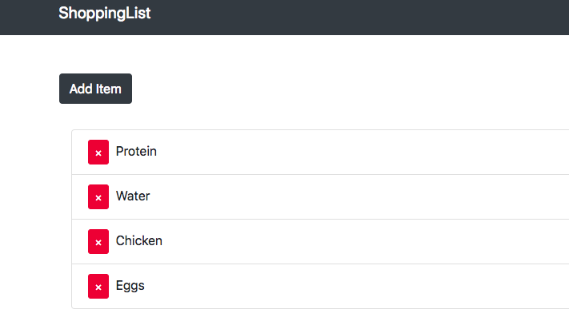

# Shopping List

This is a shopping list application.
It is a MERN (MongoDB, Express, React, Node.js) application.
It also featuers full CRUD (create, read, update, destory).

This app has been deloyed to Heroku. Given how slow Heroku is, you may find you need to refresh the page a few times to wake it up. 

Installing

> npm run dev to start BOTH client and server

client-install allows a user to download from github and only have to run 

npm install once since this will cd into the client folder

dev allows front and back end servers to run concurrently 

